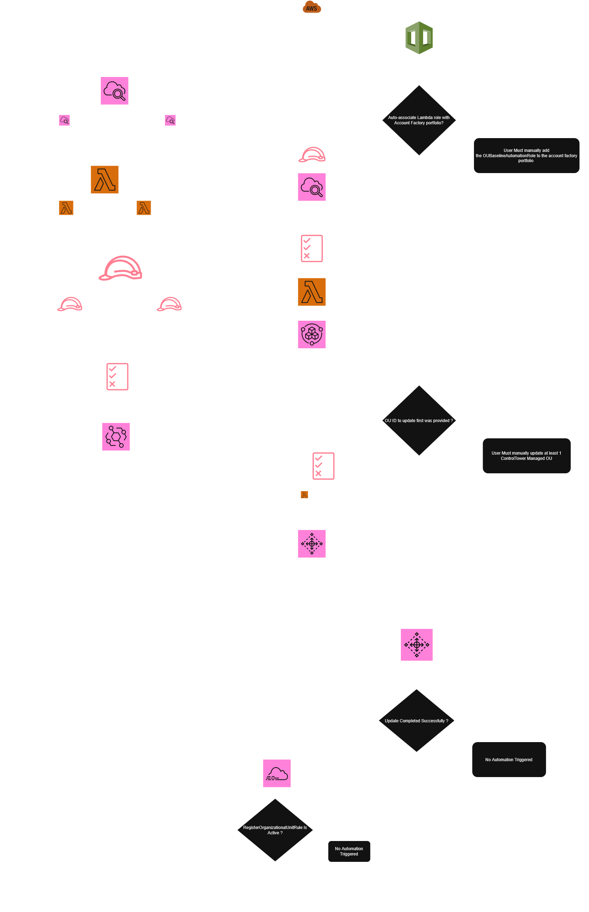
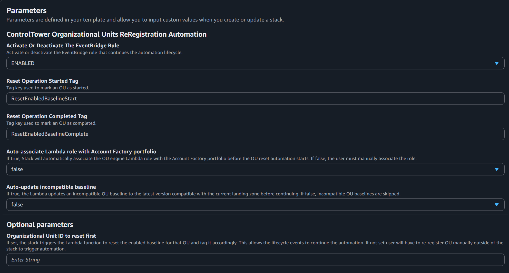
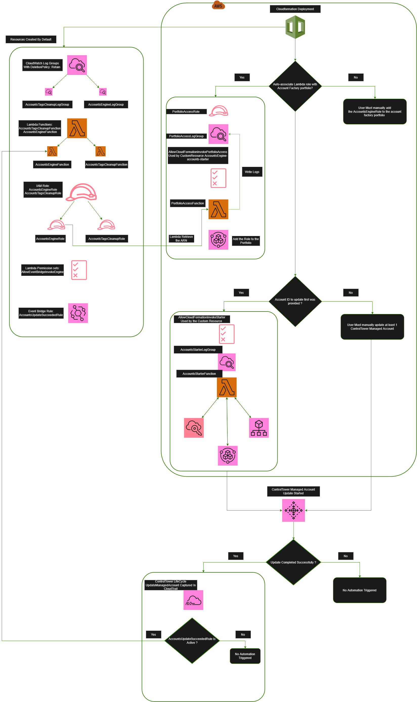
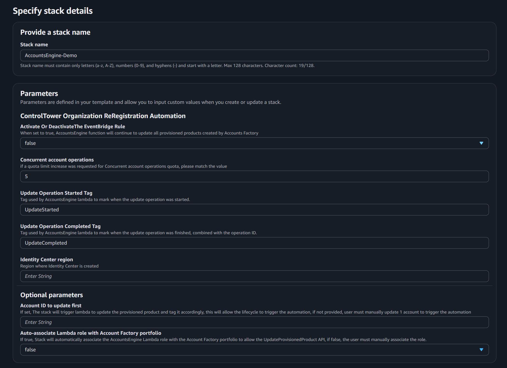
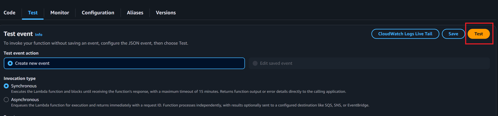

# ControlTower Organization Re-Registration Automation


> **Disclaimer:** Code is provided as-is to demonstrate a concept or workflow for AWS customers. You are responsible for ensuring it meets your requirements and for thoroughly reviewing and testing it in a sandbox environment before deploying to production.

> This project implements a scalable, event-driven automation framework to re-register AWS Control Tower environments regardless of the status of Accounts Or Organizational Units. It automates Organizational Unit re-registration and account updates using lifecycle events, EventBridge, and Lambda, ensuring consistent baseline and control enforcement across large multi-account organizations while minimizing manual operational overhead
---

## Table of Contents

* [Overview](#overview)
  * [Understanding the Mixed Governance Problem](#understanding-the-mixed-governance-problem)
  * [Understanding the issue at scale](#why-this-becomes-challenging-at-scale)
  * [The Automation Strategy](#the-automation-strategy)
  * [ResetEnabledBaseline behavior](#resetenabledbaseline-behavior)
  * [Console vs API Behavior](#console-vs-api-behavior)
* [Prerequisites](#prerequisites)
* [Architecture-Overview](#architecture-overview)
  * [Services](#services)
  * [Architecture](#architecture)
    * [Organizational Unit](#organizational-units)
      * [Organizational Units Engine Behavior Deep-Dive](#organizational-units-engine-deployment-behavior-deep-dive)
    * [Accounts](#accounts)
      * [Accounts Engine Behavior Deep-Dive](#accounts-engine-deployment-behavior-deep-dive)
* [FAQs](#faqs)
* [Cleanup](#cleanup)
* [Tenets](#tenets)
* [Revisions](#revisions)
* [Notices](#notices)
* [Authors](#authors)
* [Security](#security)
* [License](#license)

---

# Overview

## Automating OU Re-Registration to Address Mixed Governance in AWS Control Tower

Updating your Control Tower landing zone should be a routine operation. However, when issues arise afterward, especially in large organizations, the experience can quickly become frustrating.

One of the most common side effects of modifying landing zone Region settings, whether adding or removing Regions, is the introduction of **Mixed Governance** across Organizational Units where additional controls are enabled.

Let’s walk through why this happens, why it becomes operationally challenging at scale, and how we can automate the remediation process safely and effectively.

---

## Understanding the Mixed Governance Problem

When you update your landing zone and modify Region settings:

* The OU configuration is updated.
* The child accounts under those OUs do not automatically receive the same update.

This creates configuration drift between:

* The OU baseline
* The enrolled accounts

That discrepancy is what results in **Mixed Governance**.

The [documented resolution](https://docs.aws.amazon.com/controltower/latest/userguide/mixed-governance.html) is simple:

> Re-register the OU to repair mixed governance by resetting regional controls.

Re-registering forces Control Tower to synchronize the OU and all of its child accounts.

---

## Why This Becomes Challenging at Scale

In smaller environments, this is straightforward.

In larger organizations with:

* Hundreds of Organizational Units
* Thousands of accounts

It becomes significantly more complex.

Only one Organizational Unit can be re-registered at a time, which makes the process operationally challenging in large environments.

Additionally, Control Tower does not allow controls to be enabled while an Organizational Unit is in a state of Mixed Governance. This limitation can introduce compliance concerns, especially when new controls must be deployed quickly to meet governance or regulatory requirements.

You can imagine the operational overhead after each landing zone update if every OU must be manually re-registered one by one.

Clearly, automation becomes not just helpful, but necessary.

---

<a id="automation-strategy"></a>

# The Automation Strategy

To address this, the solution helps automate the re-registration process.

The [Article](https://docs.aws.amazon.com/controltower/latest/userguide/walkthrough-baseline-steps.html) does an excellent job explaining how to re-register OUs using APIs. We build on that foundation and extend it into a fully automated, event-driven solution that updates all Control Tower managed accounts.

However, there is an important detail that is often overlooked.

---

## ResetEnabledBaseline behavior

When `ResetEnabledBaseline` executes, it handles **baseline updates only**. It does not reset or re-apply optional controls that may already be enabled on the Organizational Unit.

This distinction is critical.

---

## Understanding the Difference Between Baselines and Controls

Now that we know `ResetEnabledBaseline` only addresses the baseline, let’s examine why that matters.

For greenfield organizations, this may not introduce issues. If no optional regional controls have been enabled, resetting the baseline is usually sufficient.

However, in brownfield environments where multiple optional regional controls are already enabled, resetting the baseline alone can reintroduce Mixed Governance. This happens because:

* Baselines are reset.
* Optional controls are not reset.
* Account-level configurations may remain inconsistent.

This is one of the most common causes of persistent Mixed Governance after API-driven automation.

---

## Console vs API Behavior

| Action                | Console | API |
| --------------------- | ------- | --- |
| Baseline Update       | ✅       | ✅   |
| Control Re-evaluation | ✅       | ❌   |

This solution bridges that gap using automation.


When you re-register an Organizational Unit through the **Control Tower console**, both:

* Baseline updates
* Control re-evaluations

are handled automatically.

When using APIs, the behavior is different. Baseline and control operations are distinct, and `ResetEnabledBaseline` does not cover both.

As mentioned earlier, our goal is to build a fully automated end-to-end solution that ensures the entire organization is properly updated after a landing zone change.

We start with account-level automation and then move to Organizational Unit automation.

---

# Prerequisites

Before deploying this solution, ensure:

1. A functional Control Tower environment.
2. **All accounts must** be in a non-error state to ensure smooth automation flow.
3. Sufficient permissions to deploy the CloudFormation stack and all associated resources.
4. Sufficient permissions to create the IAM roles defined in the template.

---

# Architecture-Overview

## Services

The solution utilizes:

* Control Tower [Lifecycle Events](https://docs.aws.amazon.com/controltower/latest/userguide/lifecycle-events.html)
* Amazon EventBridge
* AWS Lambda
* AWS Organizations
* AWS Service Catalog
* CloudWatch Logs
* IAM
* CloudFormation

---

## Architecture
### Organizational Units
Let’s take a look at the organizational unit Automation workflow. The diagram below illustrates the components that we will deep-dive into.


---

  ## Organizational Units Engine Deployment Behavior Deep-Dive

   1. CloudFormation begins by deploying a set of mandatory resources. These resources are created regardless of the parameter configuration.
       1. CloudWatch Log Groups
          1. OrganizationalUnitsTagsCleanupLogGroup
          2. OUBaselineAutomationLogGroup
       2. Lambda Functions
          1. OUBaselineAutomationFunction
          2. OrganizationalUnitsTagsCleanupFunction
       3. IAM Roles
          1. OrganizationalUnitsTagsCleanupRole
          2. OUBaselineAutomationRole
       4. Lambda Permission Set
          1. PermissionForRegisterRuleToInvokeLambda
   2. The stack deploys additional resources based on the configuration provided. Let us take a closer look at the available parameters.
  
   
   1. Activate Or Deactivate The EventBridge Rule
      1. This parameter controls the status of the EventBridge rule (`RegisterOrganizationalUnitRule`).
      2. The default value is set to `false`. When set to `true`, the next `RegisterOrganizationalUnit` lifecycle event captured in CloudTrail will trigger the Lambda function `OUBaselineAutomationFunction`, and its logs will be stored in `OUBaselineAutomationLogGroup`.

   2. Operation Started Tag <a id="deep-dive-ou-21"></a>
      1. This is the tag key used by the Lambda function `OUBaselineAutomationFunction` to tag each OU it processes. The value consists of the timestamp when the Update API was invoked.
      2. The Lambda checks whether the OU already has this tag. If the tag is not present, the OU is treated as not yet updated and will be tagged after it has been processed. If the tag already exists, the OU will not be processed again.

   3. Operation Completed Tag <a id="deep-dive-ou-31"></a>

      1. When the Lambda function `OUBaselineAutomationFunction` is invoked by the EventBridge rule `RegisterOrganizationalUnitRule`, and only when the lifecycle status is `SUCCEEDED`, the payload provided by the rule contains the OU ID, as shown in the example below.

      ```json
      "serviceEventDetails": {
         "registerOrganizationalUnitStatus": {
               "organizationalUnit": {
                  "organizationalUnitName": "OU_NAME",
                  "organizationalUnitId": "ou-XXX-xntt4uap"
               },
               "state": "SUCCEEDED",
               "message": "AWS Control Tower successfully registered an organizational unit.",
               "requestedTimestamp": "2026-04-14T21:55:36+0000",
               "completedTimestamp": "2026-04-14T22:03:27+0000"
         }
      }
      ```

      2. The function `OUBaselineAutomationFunction` tags the OU from the event using the tag key you defined. The tag value is set to the timestamp captured in the lifecycle event.


   4. Auto-associate Lambda role with Account Factory portfolio

      1. This parameter controls whether the stack should create additional resources to automatically associate the execution role of `OUBaselineAutomationFunction` with the Account Factory portfolio.
      2. If set to `yes`, CloudFormation will create the following additional resources:

         * CloudWatch Log Group: `PortfolioAccessLogGroup`
         * IAM Role: `PortfolioAccessRole`
         * Lambda Function: `PortfolioAccessFunction`
         * Lambda Permission Set: `AllowCloudFormationInvokePortfolioAccess`
         * Custom Resource: `AutoAddOUEngineRoleToAccountFactoryPortfolio`
      3. The custom resource triggers the Lambda function `PortfolioAccessFunction` to add the execution role of `OUBaselineAutomationFunction` to the Account Factory portfolio. This enables the role to perform reset and update operations for enabled baselines.


   5. Auto-update incompatible baseline

      1. When the landing zone version is updated, the current baseline for all OUs except for the `core` and `root` may no longer be compatible with the updated landing zone version. If `ResetEnabledBaseline` is invoked in this state, the outdated baseline will be used and the operation will fail.
      2. In this scenario, `UpdateEnabledBaseline` must be used instead of `ResetEnabledBaseline`. If this parameter is set to `true`, the Lambda function `OUBaselineAutomationFunction` checks whether the enabled baseline is [compatible with the landing zone](https://docs.aws.amazon.com/controltower/latest/userguide/table-of-baselines.html). If it is not compatible, the function performs an update. Otherwise, it proceeds with a reset.

   6. Organizational Unit ID to reset first

      1. If set to `yes`, the Lambda function will be updated to pass the OU ID.
      2. CloudFormation will also create the custom resource `StartAutomationCustomResourceWithPortfolioAccess` to trigger `OUBaselineAutomationFunction` and provide the OU ID specified in this parameter.

### Accounts

Let’s take a look at the Accounts Automation workflow. The diagram below illustrates the components that we will deep-dive into.



---

  ## Accounts Engine Deployment Behavior Deep-Dive
  > Note: We will deep-dive into each Lambda function’s logic separately. The section below focuses only on understanding how the provided configuration controls the behavior of the stack.

## Accounts Engine Deployment Behavior Deep-Dive

   1. CloudFormation begins by deploying a set of mandatory resources. These resources are created regardless of the parameter configuration. 
   
      1. CloudWatch Log Groups
   
         1. AccountsTagsCleanupLogGroup
         2. AccountsEngineLogGroup
      2. Lambda Functions
   
         1. AccountsEngineFunction
         2. AccountsTagsCleanupFunction
      3. IAM Roles
   
         1. AccountsEngineRole
         2. AccountsTagsCleanupRole
      4. Lambda Permission Set
   
         1. AllowEventBridgeInvokeEngine
         2. Event Bridge Rule
         3. AccountsUpdateSucceededRule

   2. All log groups created by the stack are configured with a **Retain** policy. This means they are not deleted when the stack is removed, allowing you to preserve logs for troubleshooting and audit purposes. 

   3. The stack deploys additional resources based on the configuration provided. Let us take a closer look at the available parameters. 
      
   
      1. Activate Or Deactivate The EventBridge Rule
   
         1. This parameter controls the status of the EventBridge rule (`AccountsEngine-accounts-update-succeeded`). 
         2. The default value is set to `false`. When set to `true`, the next `UpdateManagedAccount` lifecycle event captured in CloudTrail will trigger the Lambda function `AccountsEngineFunction`, and its logs will be stored in `AccountsEngineLogGroup`. <a id="deep-dive-312"></a>

      2. Concurrent account operations
   
         1. This parameter defines how many accounts can be updated concurrently. The default is 5, which aligns with the documented Control Tower limit. This value can be increased up to a maximum of 10, subject to approved quota increases. 
         2. It is used by the Lambda function `AccountsEngineFunction` to ensure that no more than the configured number of accounts are in an “under change” state at any given time. 
   
      3. Update Operation Started Tag
   
         1. This is the tag key used by the Lambda function `AccountsEngineFunction` to tag each account it processes. The tag value includes the timestamp when the Update API was invoked, along with the Service Catalog provisioned product event record ID. 
         2. The Lambda checks whether the account already has this tag. If the tag is not present, the account is treated as not yet updated and will be tagged after the update API is invoked. If the tag already exists, the account will not be processed    again. 
   
      4. Update Operation Completed Tag
   
         1. When the Lambda function `AccountsEngineFunction` is invoked by the EventBridge rule `AccountsUpdateSucceededRule`, and only when the lifecycle status is `SUCCEEDED`, the payload includes the account ID and update details, as shown below. <a id="deep-dive-341"></a>
   
         ```json
         "serviceEventDetails": {
             "updateManagedAccountStatus": {
                 "organizationalUnit":{
                     "organizationalUnitName":"OU_NAME",
                     "organizationalUnitId":"ou-XXXX-l3zc8b3h"
                     },
                 "account":{
                     "accountName":"ACCOUNT_NAME",
                     "accountId":"ACCOUNT_ID"
                     },
                 "state":"SUCCEEDED",
                 "message":"AWS Control Tower successfully updated a managed account.",
                 "requestedTimestamp": "2026-04-14T21:55:36+0000",
                 "completedTimestamp": "2026-04-14T22:03:27+0000"
               }
         }
         ```
   
         2. The function `AccountsEngineFunction` then tags the account using the defined tag key. The tag value is set to the timestamp captured in the lifecycle event. 

      5. Identity Center region
   
         1. This parameter specifies the Region where the IAM Identity Center instance used by Control Tower is deployed. For Control Tower managed instances, this is typically the home Region. 
         2. If a self-managed Identity Center instance is used, it may reside in a different Region. In that case, provide the appropriate Region. 
         3. The Lambda function `AccountsEngineFunction` uses this value to retrieve user details such as `SSOUserEmail`, `SSOUserFirstName`, and `SSOUserLastName`. 
   
      6. Account ID to update first
   
         1. The value must correspond to a Control Tower managed account in an active state. 
         2. If set to `false`, you must manually update at least one managed account to initiate the automation. 
         3. If a valid account ID is provided, the stack creates the following additional resources:<a id="deep-dive-363"></a>
   
            1. Lambda function: `AccountsStarterFunction`
            2. CloudWatch Log Group: `AccountsStarterLogGroup`
            3. Lambda Permission Set: `AllowCloudFormationInvokeStarter`
            4. Custom Resource: `StartAutomationCustomResourceWithPortfolioAccess` 
   
      7. Auto-associate Lambda role with Account Factory portfolio
   
         1. This parameter determines whether the stack automatically associates the IAM role `AccountsEngineRole` with the Account Factory portfolio. This enables the `AccountsEngineFunction` to call the `UpdateProvisionedProduct` API. 
         2. If set to `true`, the stack creates the following additional resources:<a id="deep-dive-372"></a>
   
            1. CloudWatch Log Group: `PortfolioAccessLogGroup`
            2. IAM Role: `PortfolioAccessRole`
            3. Lambda Function: `PortfolioAccessFunction`
            4. Custom Resource: `AutoAddEngineRoleToAccountFactoryPortfolio` 


---
  ## Lambda Functions Logic Deep-Dive


   1. AccountsEngineFunction <a id="lambda-logic-1"></a>
   
      1. As described in **[3.1.2](#deep-dive-312)** and **[3.4.1](#deep-dive-341)**, this Lambda is automatically invoked only when the EventBridge rule is enabled and the lifecycle update status is `SUCCEEDED`. 
      2. The function begins by retrieving the account ID from the incoming payload, then tags the account using the value defined for the `TagCompletedKey` parameter. The tag value is set to the timestamp included in the payload. 
      3. It then evaluates how many accounts are currently in an `UNDER_CHANGE` state and compares this count to the configured maximum (`MaxInChange`). If the number is below the limit, processing continues. Otherwise, the function exits gracefully and    logs that no update slots are currently available. 
      4. The function retrieves all accounts in the organization, sorts them by OU order, and identifies the first Control Tower managed account that does not have the `TagStartedKey` applied. 
      5. Once the next eligible account is identified, the function retrieves the associated provisioned product and locates the most recent successful event. Failed events are skipped until a successful one is found. 
      6. It then extracts `AccountEmail` and `SSOUserEmail` from the outputs of the successful provisioned product event. 
      7. The function queries IAM Identity Center in the Region specified by the `IdentityCenterRegion` parameter to retrieve `SSOUserFirstName` and `SSOUserLastName`. 
      8. A reverse lookup is performed to retrieve the `AccountName` using the account ID. 
      9. The function also retrieves the Organizational Unit ID and name where the account is currently registered. 
      10. With all required details collected, the function builds the parameter list:
   
          * AccountEmail
          * AccountName
          * ManagedOrganizationalUnit
          * SSOUserEmail
          * SSOUserFirstName
          * SSOUserLastName
      11. A final validation ensures the account is not currently in flight. If eligible, the function invokes `UpdateProvisionedProduct` using the prepared parameters. 
      12. Finally, the function tags the account using the `TagStartedKey`. The tag value combines the current timestamp with the provisioned product event record ID to improve traceability. 
   
   2. AccountsTagsCleanupFunction
   
      > This Lambda is deployed by default but is not triggered automatically. It is intended to be manually invoked to remove tags created by the automation. 
   
      1. The function lists all accounts in the organization and evaluates their tags. 
      2. If an account contains the `TagStartedKey`, it is removed. 
      3. If the `TagCompletedKey` is present, it is also removed. 
      4. No payload is required to invoke this function. A simple `{ }` payload is sufficient. <a id="deep-dive-24"></a>
      5. Example output:
   
      ```
      [INFO]	2026-03-02T19:14:36.696Z	ec0fa79f-1ab3-4be2-811c-7d943004d5d8	Removed ['UpdateStarted', 'UpdateCompleted'] from 111222333444
      [INFO]	2026-03-02T19:14:36.987Z	ec0fa79f-1ab3-4be2-811c-7d943004d5d8	Removed ['UpdateStarted', 'UpdateCompleted'] from 555666777888
      [INFO]	2026-03-02T19:14:37.299Z	ec0fa79f-1ab3-4be2-811c-7d943004d5d8	Removed ['UpdateStarted', 'UpdateCompleted'] from 111333444222
      [INFO]	2026-03-02T19:14:37.598Z	ec0fa79f-1ab3-4be2-811c-7d943004d5d8	Removed ['UpdateStarted', 'UpdateCompleted'] from 999666444111
      [INFO]	2026-03-02T19:14:38.036Z	ec0fa79f-1ab3-4be2-811c-7d943004d5d8	Removed ['UpdateStarted', 'UpdateCompleted'] from 777999888666
      ```
   
   3. PortfolioAccessFunction
   
      > This Lambda is created only when the parameter `AutoAddLambdaRoleToPortoflioAccess` is set to `true`, as described in **[3.7.2](#deep-dive-372)**. 
   
      1. The function retrieves the ARN of the IAM role `AccountsEngineRole`. 
      2. It supports three methods for discovering the Account Factory portfolio:
   
         1. Use a provided `PortfolioId` directly, which requires modifying the function to pass the parameter.
         2. If `AutomationTargetAccountId` is provided, retrieve the provisioned product for that account and extract the portfolio from its launch paths.
         3. Search all portfolios for names containing **account factory** (default behavior). 
      3. On Create or Update:
   
         1. The function discovers the portfolio ID.
         2. It invokes `associate_principal_with_portfolio()` to grant access to the IAM role `AccountsEngineRole`. 
      4. On Delete:
   
         1. The function extracts the portfolio ID and principal ARN from the `PhysicalResourceId`.
         2. It invokes `disassociate_principal_from_portfolio()` to revoke access for the IAM role. 
   
   4. AccountsStarterFunction
   
      > This Lambda is created only when the parameter `AutomationTargetAccountId` is provided with a Control Tower managed account ID, as described in **[3.6.3](#deep-dive-363)**. 
   
      1. The function follows the same logic as **[AccountsEngineFunction](#lambda-logic-1)** but operates only on the specified account. 
      2. It handles a single account and does not perform organization-wide discovery. 
      3. Only the `TagStartedKey` is applied, as the function runs once for a single account. The `TagCompletedKey` is not used. 
      4. The function is not re-invoked by automation. 
      5. It uses the `AccountsEngineRole`, ensuring consistent permissions without introducing additional roles. 

---

## FAQs
1. What do I need to have in place to use this solution?

   * Please refer to [Prerequisites](#prerequisites) for the full list of requirements.

2. How do I restart the automation if accounts fail to update successfully?

   * This solution primarily relies on lifecycle events, as outlined in the **[Automation Strategy](#automation-strategy)**. The `MaxInChange` parameter is set to 5 by default. This means that up to 4 accounts may fail, while a single successful update is sufficient to trigger the automation again. The `AccountsEngineFunction` will continue processing accounts until the `MaxInChange` limit is reached.
   * If all accounts fail, it is recommended to review the Control Tower dashboard for errors and address any underlying issues first.
   * Once the issues have been resolved, you can manually update one managed account or update the `AutomationTargetAccountId` provided to the stack. This will generate a lifecycle event, which triggers the automation again and allows it to resume normal processing.

3. How do I restart the automation if OU fail to update successfully?

   * OU re-registration is limited to one OU at a time, which is a current service limitation and cannot be changed. It is recommended to review the Control Tower dashboard for errors and resolve any underlying issues first.
   * Once the issues have been resolved, you can manually re-register one managed OU or update the OU ID provided in the `AutomationTargetOrganizationalUnitId` parameter. This will generate a lifecycle event, which triggers the automation again and allows it to resume normal processing.


4. What if I do not want the stack to manage access to the Account Factory portfolio?

   * The solution is designed to be flexible. If you prefer to manage Account Factory portfolio access manually, please ensure that the necessary access is configured before triggering any automation. Provisioned products cannot be updated unless the principal is associated with the portfolio.
   * You can deploy the solution with the EventBridge rule set to `false`. This prevents the automation from triggering automatically. Additionally, do not provide a value for the `AutomationTargetAccountId` or `AutomationTargetOrganizationalUnitId` parameters, as doing so would immediately trigger an update for the specified account or OU.
   * After manually associating the `AccountsEngineRole` or `OUBaselineAutomationRole` with the Account Factory portfolio, update the stack and set the EventBridge rule to `true` to enable automation.
   * You may then either provide a Control Tower managed account ID for `AutomationTargetAccountId`, or manually update any managed account to trigger the automation. Similarly, you can provide the OU ID for `AutomationTargetOrganizationalUnitId`, or manually re-register a Control Tower managed OU.

5. How do I stop the automation?

   * Set the EventBridge rule to `false`. This prevents the automation from triggering automatically. If you wish to resume operations later, set the value back to `true`, then manually update one account or OU, or update the account ID or OU ID provided to the stack.

6. Account or OU registration is failing. Why, and how can I resume the automation?

   * A failing account or OU can be caused by a variety of reasons. It is recommended to start by reviewing the error codes and logs, or to work with AWS Support if additional assistance is required.
   * Once the issue has been resolved, the automation can be resumed by manually updating one account or OU, or by updating the value for the `AutomationTargetAccountId` or `AutomationTargetOrganizationalUnitId` parameter.

---

## Cleanup

* Begin by invoking the `AccountsTagsCleanupFunction` or `OrganizationalUnitsTagsCleanupFunction` to remove all tags created by the automation, as described in **[2.4](#deep-dive-24)**, No payload is required to invoke this function. A simple `{ }` payload is sufficient.
   Lambda function can be invoked through the AWS Console
   
   
   Or simply through the command below
   ```bash
   aws lambda invoke   --function-name OrganizationalUnitsTagsCleanupFunction   --payload '{}'   response.json
   cat response.json
   ```
* Once the tags have been cleaned up, proceed with deleting the CloudFormation stacks. This will remove all resources deployed by the solution.
* If the `PortfolioAccessFunction` was deployed, access to the Account Factory portfolio will be revoked for the associated IAM roles as part of the cleanup process.

---

## Tenets

* **Works at any scale:** Designed to support organizations of any size by leveraging lifecycle events as the primary automation trigger.

* **Flexible:** The solution is intentionally configurable, allowing you to adjust parameters to align with your governance model and operational requirements while maintaining compliance.

* **Do no harm:** No destructive actions are performed against workloads. The only delete operations executed by the solution are limited to removing automation tags and revoking access to the Account Factory portfolio.

* **No assumptions:** The solution does not assume a specific configuration. It is important to review your internal limitations, service quotas, and governance policies in advance to ensure proper alignment.

---

## Revisions

- 2026-04-15 - Initial release

## Notices

Customers are responsible for making their own independent assessment of the information in this Guidance. This Guidance: (a) is for informational purposes only, (b) represents AWS current product offerings and practices, which are subject to change without notice, and (c) does not create any commitments or assurances from AWS and its affiliates, suppliers or licensors. AWS products or services are provided “as is” without warranties, representations, or conditions of any kind, whether express or implied. AWS responsibilities and liabilities to its customers are controlled by AWS agreements, and this Guidance is not part of, nor does it modify, any agreement between AWS and its customers.

This library is licensed under the MIT-0 License. See the [LICENSE](LICENSE) file.

## Authors
- Karim Omar, Cloud Support Engineer

## Security

See [CONTRIBUTING](CONTRIBUTING.md#security-issue-notifications) for more information.

## License

This library is licensed under the MIT-0 License. See the LICENSE file.